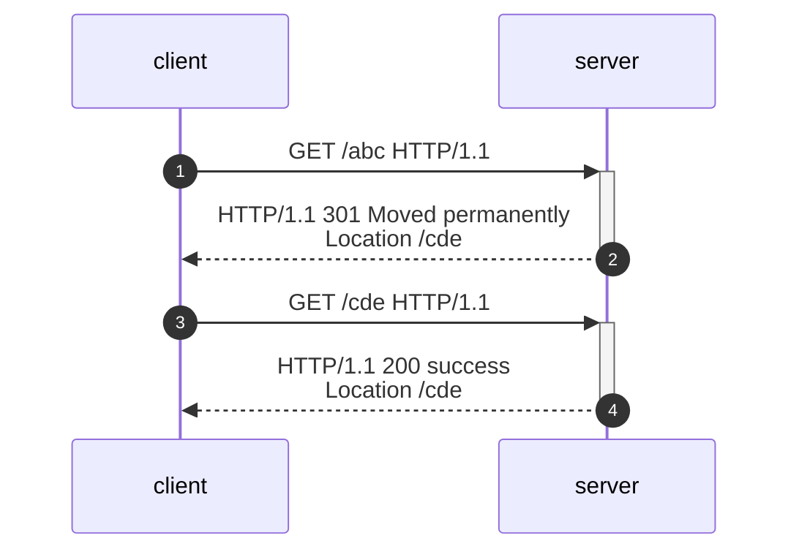
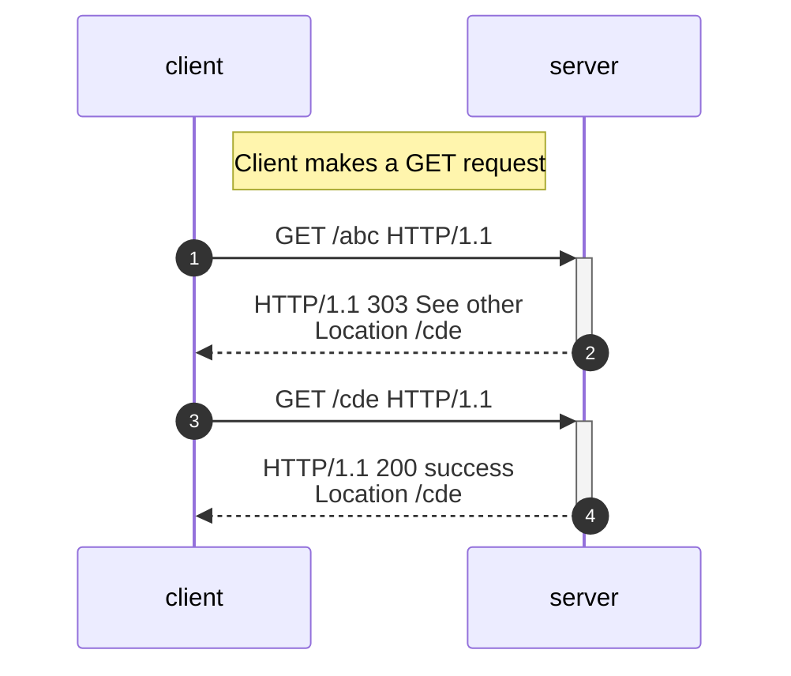
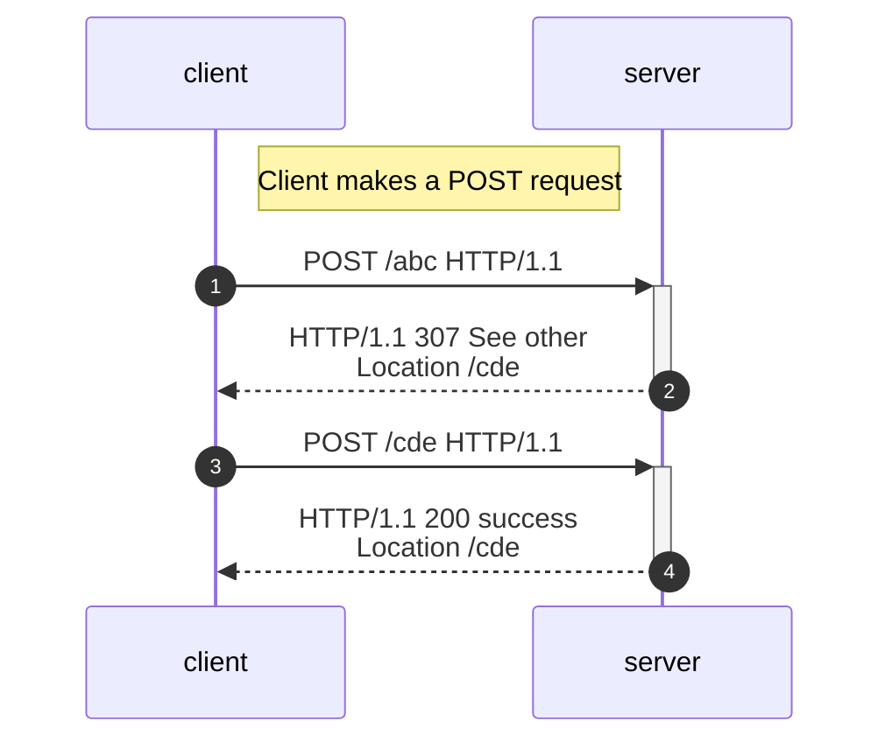

# Http overview

## notations

* sp -> space
* crlf -> Carriage Return Line Feed

## http structure

The request and response are just text that conform to the http rules.
The request and response both have a starting line, headers  and a body.
Request starting line is called the "request line" which consists of:

Client -> Server :: Request

* Request line
  * Method sp URI sp HTTP-version crlf
  * e.g. GET /abc HTTP/1.1
  * e.g. POST /cde HTTP/1.1

* Headers
* Body

Client -> Server :: Response

* Status Line
  * HTTP-version sp StatusCode sp ReasonPhrase crlf
  * e.g. HTTP/1.1 200 OK
* Headers
* Body

RFC-7231 ->
godoc.org/net/http -> https://pkg.go.dev/net/http#pkg-constants

## 301-303-307 status codes

301 -> moved permanently -> when the server responds with that status the browser will go directly to the location - the next time the resource is needed- when the resource has been permanently moved instead of the original location. In other words, the user agent(like the browser) MAY use Location field for automatic redirection the next time the resource is needed.

303 -> 'see other' -> always changes the method, for example if the server responds to a post' with a '303' and a value for the location header then the client is expected tu use "GET" to obtain that resource in the header.

307 -> 'temporary redirect' -> will preserve the method and will redirect temporarily to some other location. If the request is
'post' then it still will be post. The same fro 'GET'

